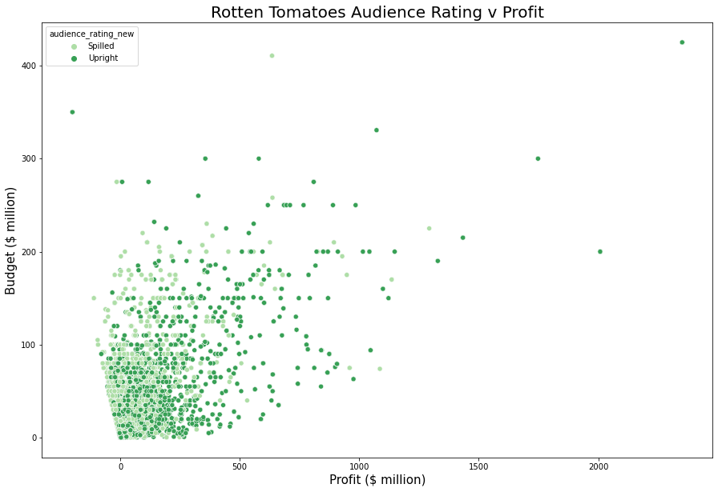

# Flatiron Data Science: Phase 1 Project

**Authors**: Andrew Rowan

## Overview

A one-paragraph overview of the project, including the business problem, data, methods, results and recommendations.

## Business Problem

Microsoft sees all the big companies creating original video content and they want to get in on the fun. They have decided to create a new movie studio, but they don’t know anything about creating movies. I have been charged with exploring what types of films are currently doing the best at the box office and translate those findings into actionable insights that the head of Microsoft's new movie studio can use to help decide what type of films to create and what they should keep in mind as they enter into a new and highly competitive sector.

## Data

Data has been provided from the following sources:

* [Rotten Tomatoes](https://www.rottentomatoes.com/)
* [IMDB](https://www.imdb.com/)
* [Box Office Mojo](https://www.boxofficemojo.com/)
* [The Numbers](https://www.the-numbers.com/)
* [The Movie DB](https://www.themoviedb.org/)


These datasets provide many different pieces of information for thousands of movies - movie budget, gross and domestic revenue, review ratings, release dates etc. 

## Methods

I will utilise descriptive data analysis techniques to try and infer relationships between variables within each dataset. I will also create new variables such as profit and Return on Investment in an attempt to determine best investment opportunities for Microsoft.

I will try and answer the following:

* Which are the most profitable movies ever?

* Is there a good time to release a movie?

* Is there a specific genre that should be prioritised?

* Does making a highly rated movie really impact potential profits?

* Who could direct a direct a highly rated movie for Microsoft?


## Results


### Most Profitable of All Time


Alot of recognisable names, and alot of sequels and franchises...

### Competitive Industry


The landscape of movie making has changed dramatically since the late 1990's, it is now a much more competitive industry as can be seen by the number of movies being made.

### Do Big Budgets Help?


Bigger budget movies tend to have higher profits, however, having a big budget is no guarantee of success. There is no correlation between movie budget and return on investment (ROI)


### Best Time to Release?


Summer months and the run up to Christmas are the best time to release a movie, the reasons for this should be explored further.
Further analysis showed that July has the highest percentage of profitable movies on average.


### What Genre?


Animation leads the way in terms of mean profit per movie, it also performs strongly in the ROI category (not shown here).

### Impact of Public Opinion on Profits



Not too surprisingly, public opinion matters. Movies with a higher audience rating tend to be more profitable. This plot captures quite well the impact of "word-of-mouth". 

### Impact of Critic's Ratings on Profits 


Movies that do not make profits are more likely to have received poor reviews from critics. However, the reverse isn't seen in profitable movies. The correlation betweeen profitable movies and critics scores is weaker. If you think back to the first plot, there's not many Best Picture Oscar Winners in the top 25...

### Who Should Direct?

From analysing the top 250 highest rated animation films, there are many talented directors who could lead this project. John Musker, Brad Bird, Dean DeBlois, Jennifer Lee to name but a few, they are responsible for hits such as Moana, The Incredibles, Lilo & Stitch and Frozen but are no one hit wonders - they each have multiple entries in the top 250.


## Conclusions

* Movies are making more profits now than at any other point in history, however, budgets have increased during that time which reduces the Return on Investment.


* The Animation genre has the highest percentage of profitable movies of any other genres and this would be the first area in which I would recommend Microsoft's focused. Animation genre could be broken down into many sub-genres and this would be a line of work that needs further study. 


* Horror is a genre which can reap big rewards, particularly in terms of ROI. It is not as consistently profitable as movies in the animation genre but is certainly worth exploring further.


* The recommended month for release would be July, the data shows July has the highest percentage of profitable movies than all others. Not only that, movies released in May / June / July and November / December are the most profitable. The reason for this should be investigated, it would be interesting to see if there is a correlation between school holidays and movie success and if this is impacted by the rating (PG-13, PG etc.) that the movie is designated. This recommendation is preliminary, release month by genre should be explored.


* Rotten Tomatoes rating vs Profits show the majority of loss making movies have received poor reviews, this indicates achieving positive reviews could be important in determining the success of a movie. 


* A better understanding of what is covered under the "budget" term, does this include marketing? If not this is something else which will eat into profits that is not accounted for here. 


* There is a moderate positive correlation between budget and profit, this does not prove causality and spending money is no guarantee on the ROI (no correlation between budget and ROI), money needs to be spent in the correct manner on getting the right people - preferably talent that has a proven track record of delivering high quality movies.


* In terms of directors, John Musker, Brad Bird, Dean DeBlois, Jennifer Lee would near the top of any list to be approached. All have been in charge of delivering successful animated movies.


* Since this is an animated movie, I have not fully explored options for lead actor roles. I would imagine the influence a lead actor has on movie profits would be dampened in the Animation genre when compared to other live action genres - this would need to be confirmed. There are still many famous names that appear in successful animated films, actors with a background in comedy is particularly common. 


* I would recommend a standalone study of the potential future impact streaming companies and platforms could have on future movies' profitabilty and an analysis of the number of people visiting movie theatres.


* Further work is recommended on analysing big budget failures of the last 10 years, how and why did they fail?


* Investigate additional revenue streams - merchandise and games, both could be lucrative and Microsoft would be well placed to take advantage in the gaming sector.


## For More Information

Please review our full analysis in [our Jupyter Notebook](./dsc-phase1-project-template.ipynb) or our [presentation](./DS_Project_Presentation.pdf).

For any additional questions, please contact **name & email, name & email**

## Repository Structure

Describe the structure of your repository and its contents, for example:

```
├── README.md                           <- The top-level README for reviewers of this project
├── dsc-phase1-project-template.ipynb   <- Narrative documentation of analysis in Jupyter notebook
├── DS_Project_Presentation.pdf         <- PDF version of project presentation
├── data                                <- Both sourced externally and generated from code
└── images                              <- Both sourced externally and generated from code
```
